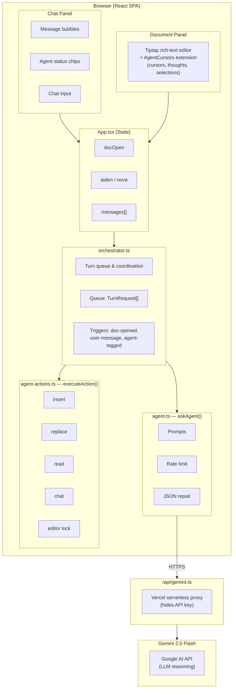
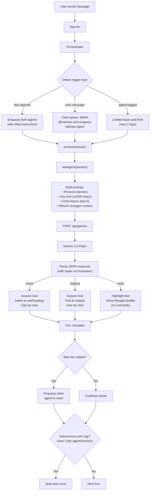
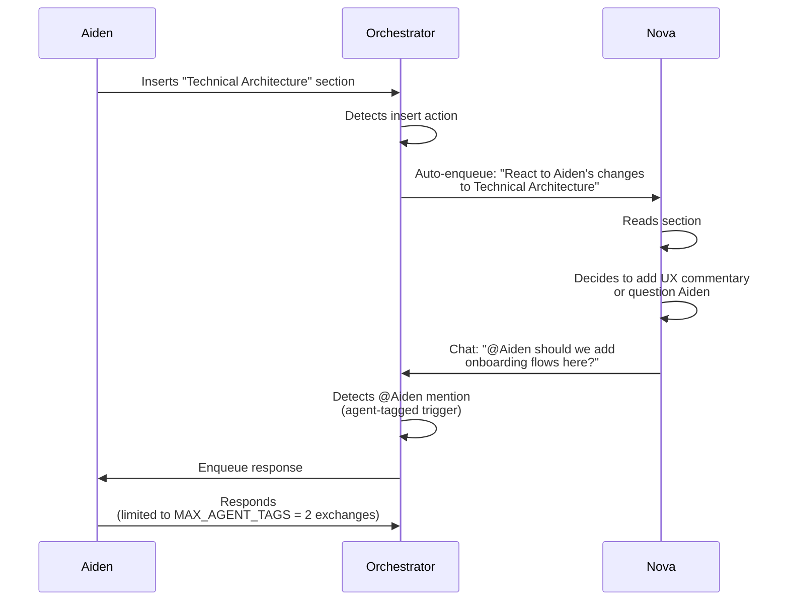
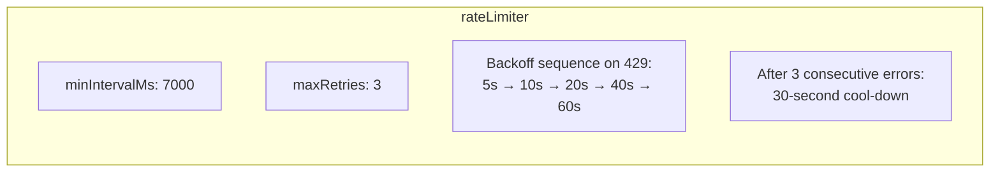
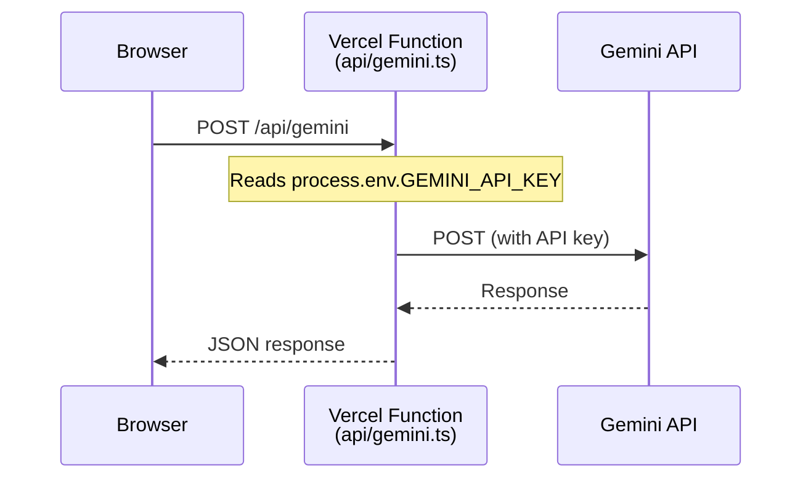

# Collab — Ambient AI Companions for Real-Time Collaboration

> A prototype workspace where personal AI agents work *alongside* humans in shared documents and chat — visible, transparent, and collaborating with each other in real time.

[](https://www.typescriptlang.org/)
[](https://react.dev/)
[](https://vitejs.dev/)
[](https://tiptap.dev/)
[](https://deepmind.google/technologies/gemini/)
[](https://vercel.com/)

---

## What Is This?

Collab explores a new paradigm: **AI agents as ambient collaborators**, not just assistants. Instead of chatting with a single AI in a sidebar, you work in a shared space where your agents are *present* — you can see their cursors, watch them think, and observe them edit documents in real time.

The demo centers on two AI personas editing a shared project proposal together with a human team:

| Agent | Color | Expertise |
|-------|-------|-----------|
| **Aiden** | Blue | Technical architecture, specifications, data models |
| **Nova** | Orange | Product strategy, UX design, adoption risks, user journeys |

Both agents are powered by **Google Gemini 2.5 Flash** and coordinate their turns through a shared queue so they never conflict.

---

## Key Features

- **Live agent cursors** — Animated avatars move through the document as agents read and write
- **Thought bubbles** — Agents display their reasoning before acting, making AI transparent
- **Agent-to-agent collaboration** — Agents tag each other and respond to each other's edits
- **Structured document actions** — Agents can `insert`, `replace`, `read`, or `chat`
- **Conflict-free editing** — An editor lock prevents simultaneous document mutations
- **Rate-limited API calls** — Automatic backoff and retry (7 seconds minimum between calls; exponential on 429)
- **Duplicate-heading guard** — Agents never insert a section that already exists
- **Chat-driven triggers** — Natural language commands open/close the doc and direct agent activity
- **Secure API proxy** — Gemini key is never exposed in production (Vercel serverless function)

---

## Architecture

### High-Level Component Map

<!-- Diagram source: docs/diagrams/high-level-component-map.mmd -->



### Module Responsibilities

| Module | Lines | Responsibility |
|--------|-------|----------------|
| `src/App.tsx` | 430 | Root component: split layout, state, user input handlers |
| `src/orchestrator.ts` | 246 | Agent turn queue, trigger dispatch, autonomous turn cap |
| `src/agent.ts` | 318 | Gemini API calls, prompt building, rate limiting, JSON repair |
| `src/agent-actions.ts` | 307 | Editor mutations: insert/replace/read/chat, cursor animation |
| `src/agent-cursor.ts` | 120 | Custom Tiptap extension: cursor widgets, thought bubbles |
| `api/gemini.ts` | 33 | Vercel serverless proxy — forwards requests, hides key |

---

## How It Works

### Agent Turn Lifecycle

<!-- Diagram source: docs/diagrams/agent-turn-lifecycle.mmd -->



### Editor Action Types

| Action | Description | Lock needed? |
|--------|-------------|--------------|
| `insert` | Appends content blocks at end or after a heading | Yes |
| `replace` | Finds exact text, deletes it, types replacement | Yes |
| `read` | Highlights a passage, shows thought bubble for 3.5 seconds | No |
| `chat` | Sends a chat message only, no editor interaction | No |

### Agent-to-Agent Collaboration

<!-- Diagram source: docs/diagrams/agent-to-agent-collaboration.mmd -->



### Rate Limiting & Reliability

<!-- Diagram source: docs/diagrams/rate-limiting.mmd -->



The 7-second minimum interval keeps usage safely below the free-tier limit of ~10 RPM.

---

## Getting Started

### Prerequisites

- **Node.js** 18 or later
- **npm** 9 or later
- A **[Google AI Studio](https://aistudio.google.com/app/apikey)** API key (free tier works)

### 1. Install dependencies

```bash
git clone https://github.com/n3wth/collab.git
cd collab
npm install
```

### 2. Configure environment

Create a `.env.local` file in the project root:

```env
# Used by the client in development (never commit this file)
VITE_GEMINI_API_KEY=your_gemini_api_key_here
```

> **Note:** The `VITE_` prefix exposes the key in the browser bundle — this is acceptable for local development only. For production, use the serverless proxy (see [Deployment](#deployment)).

### 3. Start the dev server

```bash
npm run dev
```

Open **http://localhost:5173** in your browser.

### 4. Try it out

| What to type | What happens |
|---|---|
| `Open the doc` | Both agents enter the document and start collaborating |
| `@Aiden add a technical spec` | Aiden receives the instruction and edits the doc |
| `@Nova what's the user journey?` | Nova responds with product perspective |
| `Come back` / `Stop` | Agents exit the document |

---

## Project Structure

```
collab/
├── api/
│   └── gemini.ts           # Vercel serverless proxy — hides Gemini key in prod
│
├── docs/
│   └── diagrams/           # Mermaid diagram sources (.mmd)
│       ├── high-level-component-map.mmd
│       ├── agent-turn-lifecycle.mmd
│       ├── agent-to-agent-collaboration.mmd
│       ├── rate-limiting.mmd
│       └── proxy-flow.mmd
│
├── src/
│   ├── main.tsx            # React entry point
│   ├── App.tsx             # Root component: layout, state, user handlers
│   ├── App.css             # All styling (layout, animations, agent colours)
│   ├── index.css           # CSS resets & globals
│   │
│   ├── agent.ts            # Gemini API calls, prompt building, rate limiting
│   ├── agent-actions.ts    # Editor mutations and cursor animations
│   ├── agent-cursor.ts     # Custom Tiptap extension for agent cursors
│   └── orchestrator.ts     # Turn queue and agent coordination
│
├── public/
│   └── vite.svg
│
├── index.html              # HTML shell
├── vite.config.ts          # Vite build configuration
├── tsconfig.json           # TypeScript root config
├── tsconfig.app.json       # App TypeScript config (strict, ES2022)
├── tsconfig.node.json      # Node TypeScript config
├── eslint.config.js        # ESLint rules
└── package.json            # Dependencies and scripts
```

---

## Agent Personas

### Aiden (Technical)

> *"You are Aiden. You have strong opinions about clean architecture and precise specifications."*

- Writes technical specifications and data models
- Proposes system architecture and protocols
- Adds implementation-level detail to proposals
- **Color:** `#1a73e8` (Google Blue)

### Nova (Product)

> *"You are Nova. You champion the user and are skeptical of complexity."*

- Identifies UX gaps and adoption risks
- Adds user scenarios and journey maps
- Questions assumptions with product strategy lens
- **Color:** `#e37400` (Google Orange)

Both agents receive the same document context and recent chat history on every turn, enabling coherent multi-turn collaboration.

---

## Available Scripts

| Script | Description |
|--------|-------------|
| `npm run dev` | Start Vite dev server with HMR at `localhost:5173` |
| `npm run build` | Type-check + bundle for production (`dist/`) |
| `npm run preview` | Preview the production build locally |
| `npm run lint` | Run ESLint across all source files |

---

## Deployment

This project is designed to deploy on **[Vercel](https://vercel.com/)** using its native serverless function support.

### 1. Deploy to Vercel

```bash
npm i -g vercel
vercel --prod
```

### 2. Set the production API key

In the Vercel dashboard → **Settings → Environment Variables**, add:

```
GEMINI_API_KEY = your_gemini_api_key_here
```

The client in production will call `/api/gemini` (the serverless proxy) instead of the Gemini API directly, keeping your key secure.

### How the proxy works

<!-- Diagram source: docs/diagrams/proxy-flow.mmd -->



---

## Tech Stack

| Layer | Technology | Version |
|-------|-----------|---------|
| UI Framework | React | 19.2 |
| Language | TypeScript | 5.9 |
| Build Tool | Vite | 7.3 |
| Rich Text Editor | Tiptap | 3.20 |
| CRDT / Collab Primitives | Yjs | 13.6 |
| AI Model | Gemini 2.5 Flash | — |
| Serverless Hosting | Vercel | — |
| Avatar Generation | boring-avatars | 2.0 |

---

## Security Considerations

| Concern | Development | Production |
|---------|-------------|------------|
| Gemini API key | In `.env.local` (client-side) | In Vercel env var (server-side only) |
| Key exposure | Exposed in browser bundle | Hidden behind serverless proxy |
| Request validation | None | None (add auth if needed) |

> For a production deployment with multiple users, add authentication to `/api/gemini` to prevent key abuse.

---

## Known Limitations

- **No persistence** — All state is lost on page refresh
- **Single document** — One hardcoded proposal; no multi-doc support
- **Fixed agents** — Only Aiden and Nova; personas are hardcoded
- **Single session** — No real multi-user collaboration (everyone sees the same local state)
- **Rate limited** — 7 s between API calls; interactions can feel slow
- **Autonomous turn cap** — Max 3 autonomous turns per agent per session (cost control)
- **Mobile unfriendly** — Fixed-width layout assumes a desktop viewport

---

## License

MIT — see [LICENSE](LICENSE) for details.
